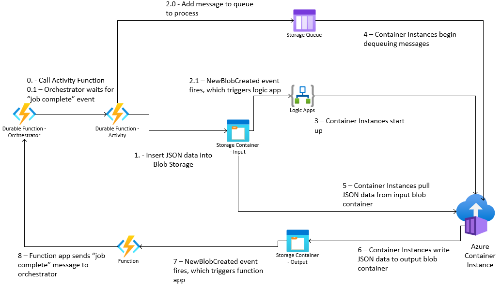
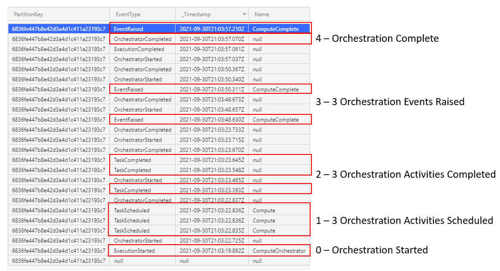
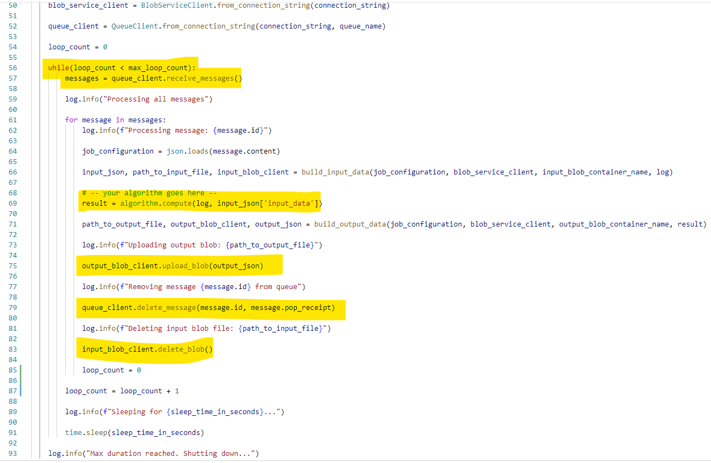
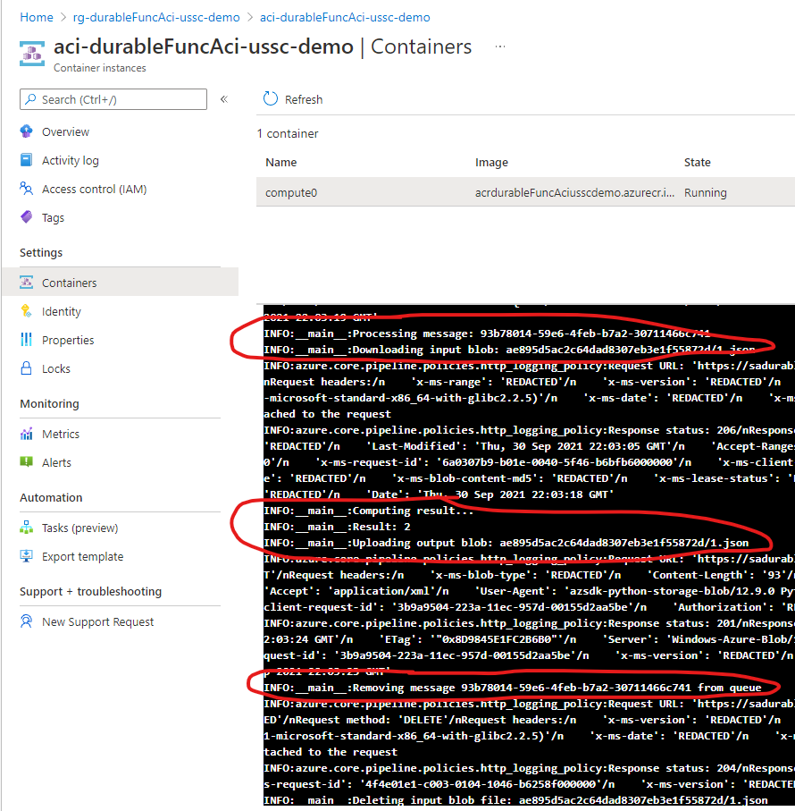

# durable-func-and-aci

This demo uses [Azure Durable Functions](https://docs.microsoft.com/en-us/azure/azure-functions/durable/durable-functions-overview?tabs=python), [Event Grid](https://docs.microsoft.com/en-us/azure/event-grid/overview) & [Azure Container Instance](https://docs.microsoft.com/en-us/azure/container-instances/) to provide a general purpose orchestrated compute engine.



## Disclaimer

**THE SOFTWARE IS PROVIDED "AS IS", WITHOUT WARRANTY OF ANY KIND, EXPRESS OR IMPLIED, INCLUDING BUT NOT LIMITED TO THE WARRANTIES OF MERCHANTABILITY, FITNESS FOR A PARTICULAR PURPOSE AND NONINFRINGEMENT. IN NO EVENT SHALL THE AUTHORS OR COPYRIGHT HOLDERS BE LIABLE FOR ANY CLAIM, DAMAGES OR OTHER LIABILITY, WHETHER IN AN ACTION OF CONTRACT, TORT OR OTHERWISE, ARISING FROM, OUT OF OR IN CONNECTION WITH THE SOFTWARE OR THE USE OR OTHER DEALINGS IN THE SOFTWARE.**

## Prerequisites

Install the following prerequisites.

- [Azure CLI](https://docs.microsoft.com/en-us/cli/azure/)
- [Azure Functions Core Tools](https://docs.microsoft.com/en-us/azure/azure-functions/functions-run-local?tabs=v3%2Clinux%2Ccsharp%2Cportal%2Cbash%2Ckeda)

## Deployment

1.  Create a new resource group in your Azure subscription

1.  Navigate to `infra/init` directory

1.  Run the Azure CLI command to deploy the initial infrastructure (substitute your resource group name)

    ```shell
    az deployment group create --resource-group rg-durableFuncAci-ussc-demo --template-file ./main.bicep --parameters ./demo.parameters.json
    ```

1.  Navigate to the `src/compute` directory

1.  Submit the container compute code to the [Azure Container Registry](https://docs.microsoft.com/en-us/azure/container-registry/) to build & store the Docker image (substitute your container registry name)

    ```shell
    az acr build --image compute --registry acrdurableFuncAciusscdemo --file Dockerfile .
    ```

1.  Navigate to the `src/orchestrator` directory

1.  Deploy the Azure Durable Function code to Azure (substitute the name of your function app)

    ```shell
    func azure functionapp publish func-durableFuncAci-ussc-demo
    ```

1.  Navigate to the `infra/container` directory

1.  Deploy the container infrastructure to Azure (you will have to substitute some of these values for the Azure resource names that were created in the earlier step, all of these values can be found in the output of the previous Azure infrastructure deployment)

    ```shell
    az deployment group create --resource-group rg-durableFuncAci-ussc-demo --template-file ./main.bicep --parameters ./demo.parameters.json --parameters storageAccountName=sadurablefuncaciusscdemo --parameters containerRegistryName=acrdurableFuncAciusscdemo --parameters inputQueueName=input --parameters imageName=compute --parameters imageVersion=latest --parameters inputStorageContainerName=input --parameters outputStorageContainerName=output --parameters numberOfContainersToCreate=1 --parameters logAnalyticsWorkspaceName=la-durableFuncAci-ussc-demo --parameters newBlobCreatedEventGridTopicName=egt-NewInputBlobCreated-durableFuncAci-ussc-demo --parameters storageAccountInputContainerName=input --parameters aciConnectionName=aci --parameters eventGridConnectionName=azureeventgrid --parameters orchtestrationFunctionAppName=func-durableFuncAci-ussc-demo --parameters storageAccountOutputContainerName=output
    ```

1.  Since you are running this manually, you will need to authorize the Logic App connections to access the Azure resources (start the ACIs and subscribe to the Event Grid events). In a production deployment, this would be done via a service principal.

    1.  Navigate to the [Azure portal](https://portal.azure.com) and navigate to your subscription/resource group

    1.  Click on the `aci` resource (the API connection to the Azure Container Instance)

    1.  Click on the `Edit API connection` blade

    1.  Click on the `Authorize` button

    1.  Click on the `Save` button

1.  Repeat the previous step for the `azureeventgrid` API connection in the Azure portal

## Execute

The Azure Durable Function has been set up to respond to an HTTP trigger. Run a `curl` command to kick it off.

```shell
curl --request POST --url https://func-durablefuncaci-ussc-demo.azurewebsites.net/api/orchestrators/ComputeOrchestrator --header "Content-Length: 0"
```

You will get an output with a unique identifier for the orchestration run & some URIs to get the status.

```json
{
  "id": "dcd92a866df548f5b60d26eb1dc2a2fe", 
  "statusQueryGetUri": "https://func-durablefuncaci-ussc-demo.azurewebsites.net/runtime/webhooks/durabletask/instances/dcd92a866df548f5b60d26eb1dc2a2fe?taskHub=funcdurableFuncAciusscdemo&connection=Storage&code=XnMz3JoDtNBVyULRVVfSUE9wBkIxKuUNUBQhETroV/5g5LLaQC3c4w==", 
  "sendEventPostUri": "https://func-durablefuncaci-ussc-demo.azurewebsites.net/runtime/webhooks/durabletask/instances/dcd92a866df548f5b60d26eb1dc2a2fe/raiseEvent/{eventName}?taskHub=funcdurableFuncAciusscdemo&connection=Storage&code=XnMz3JoDtNBVyULRVVfSUE9wBkIxKuUNUBQhETroV/5g5LLaQC3c4w==", 
  "terminatePostUri": "https://func-durablefuncaci-ussc-demo.azurewebsites.net/runtime/webhooks/durabletask/instances/dcd92a866df548f5b60d26eb1dc2a2fe/terminate?reason={text}&taskHub=funcdurableFuncAciusscdemo&connection=Storage&code=XnMz3JoDtNBVyULRVVfSUE9wBkIxKuUNUBQhETroV/5g5LLaQC3c4w==", 
  "rewindPostUri": "https://func-durablefuncaci-ussc-demo.azurewebsites.net/runtime/webhooks/durabletask/instances/dcd92a866df548f5b60d26eb1dc2a2fe/rewind?reason={text}&taskHub=funcdurableFuncAciusscdemo&connection=Storage&code=XnMz3JoDtNBVyULRVVfSUE9wBkIxKuUNUBQhETroV/5g5LLaQC3c4w==", 
  "purgeHistoryDeleteUri": "https://func-durablefuncaci-ussc-demo.azurewebsites.net/runtime/webhooks/durabletask/instances/dcd92a866df548f5b60d26eb1dc2a2fe?taskHub=funcdurableFuncAciusscdemo&connection=Storage&code=XnMz3JoDtNBVyULRVVfSUE9wBkIxKuUNUBQhETroV/5g5LLaQC3c4w==", 
  "restartPostUri": "https://func-durablefuncaci-ussc-demo.azurewebsites.net/runtime/webhooks/durabletask/instances/dcd92a866df548f5b60d26eb1dc2a2fe/restart?taskHub=funcdurableFuncAciusscdemo&connection=Storage&code=XnMz3JoDtNBVyULRVVfSUE9wBkIxKuUNUBQhETroV/5g5LLaQC3c4w=="
}
```

You can query the status by either curling the `statusQueryGetUri`.

**statusQueryGetUri**

```shell
curl "https://func-durablefuncaci-ussc-demo.azurewebsites.net/runtime/webhooks/durabletask/instances/dcd92a866df548f5b60d26eb1dc2a2fe?taskHub=funcdurableFuncAciusscdemo&connection=Storage&code=XnMz3JoDtNBVyULRVVfSUE9wBkIxKuUNUBQhETroV/5g5LLaQC3c4w=="
```

```json
{
  "name":"ComputeOrchestrator",
  "instanceId":"dcd92a866df548f5b60d26eb1dc2a2fe",
  "runtimeStatus":"Running",
  "input":null,
  "customStatus":null,
  "output":null,
  "createdTime":"2021-10-01T13:36:25Z",
  "lastUpdatedTime":"2021-10-01T13:36:26Z"
}
```

Here are the results using the [Azure Storage Explorer](https://docs.microsoft.com/en-us/azure/vs-azure-tools-storage-explorer-blobs)



## Orchestration

The orchestration function manages the overall work process. Each step reports its status back to the orchestration function. It keeps track of the status of all work.

Here is the overall flow:

1.  A HTTP request is received to the Durable Function endpoint
1.  The orchestration function kicks off (defined in `src/orchestrator/ComputeOrchestrator/__init__.py`)
1.  The orchestration function generates some input data and begins the orchestration
1.  For each input data block, a `Compute` function is called (defined in `src/orchestration/Compute/__init__.py`)
1.  Each `Compute` function writes an input blob to the Azure Blob Storage input container & a message to the Azure Storage Queue with the path to the file
    - Note that the `Compute` function doesn't call any actual computation function, all it does it put an input file in storage & a path to the file in the queue, EventGrid will then fire and begin computation. This makes it so that the `Compute` function doesn't have to know anything about how the computation actually occurs. They are loosely coupled.
1.  The Azure Storage Blob input container will fire a `Microsoft.Storage.BlobCreated` EventGrid message. This will get routed to the Logic App that is subscribed to that event
1.  The Logic App will start up the Azure Container Instance (ACI) if it is shut down (the ACIs are set to shut down after a period of time if they have nothing to process)
1.  The Azure Container Instance will pull each message off the queue, process the input data & write output data back to blob storage
1.  When an output blob is created in the Azure Blob Storage output container, another `Microsoft.Storage.BlobCreated` message will get created. Another Azure Function will get called to process this message.
1.  The Azure Function (defined in `src/orchestrator/ComputeComplete/__init__.py`) will raise an event so the orchestration function is notified that a computation is complete.
1.  After all the computations are complete (meaning all of the raise events have fired), the orchestration function will report that its status is `Complete`

## Container compute

Each container is self contained and does not communicate with the other containers. It only reads the next message from the Azure Storage Queue and processes it. The Azure Storage Queue ensures a message is only processed by 1 container. If that container fails to complete the processing of the message, it will be put back on the queue and processed by another container. Once the container has received a message, it downloads the message from the Azure Blob Storage. It then computes the result and writes the result to a different Azure Blob Storage container. It then reports success to the Storage Queue and deletes the original input data. Once the container runs out of messages to process, it will shut-down after the `max_idle_time_in_minutes` is reached.



Here is an example of the container log while processing.



## References

- https://docs.microsoft.com/en-us/azure/azure-functions/durable/durable-functions-overview?tabs=python
- https://docs.microsoft.com/en-us/azure/storage/common/storage-introduction?toc=/azure/storage/blobs/toc.json
- https://docs.microsoft.com/en-us/azure/storage/queues/storage-queues-introduction
- https://docs.microsoft.com/en-us/azure/event-grid/overview
- https://docs.microsoft.com/en-us/azure/container-instances/
- https://docs.microsoft.com/en-us/azure/logic-apps/
- https://docs.microsoft.com/en-us/cli/azure/
- https://docs.microsoft.com/en-us/azure/container-registry/
- https://docs.microsoft.com/en-us/azure/vs-azure-tools-storage-explorer-blobs
